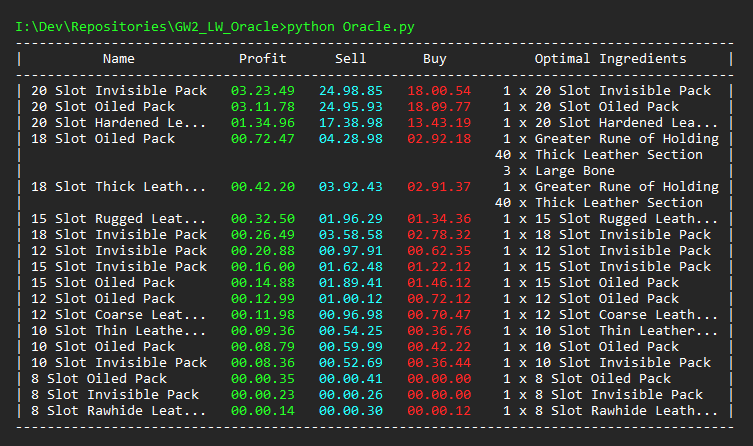

# Guild Wars 2 Leatherworking Oracle

### Author: Mikhail Andrenkov

---

#### About

 This simple project aims to find the most efficient item to buy, craft, and sell on the <i>Guild Wars 2</i> trading post.

---

#### Sources

 The leatherworking crafting information was obtained from the <a href="https://wiki.guildwars2.com/wiki/Leatherworker">Guild Wars 2 Wiki</a>.

 Current market prices are obtained from the <a href="https://www.gw2tp.com/">GW2TP Website</a>.

---

### Screenshots
#### Item Listing with Regex ``"([0-9A-Za-z\s]+? Pack)"``

